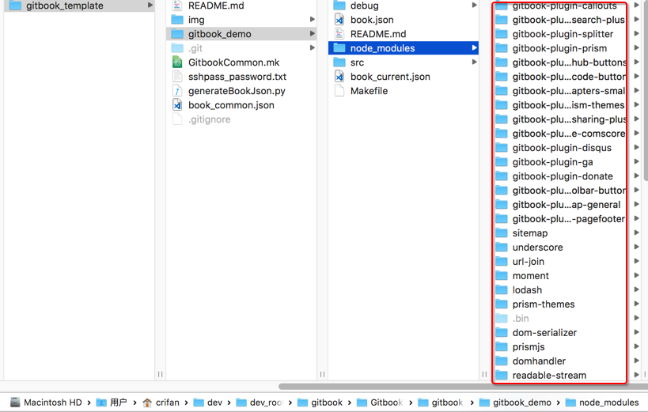
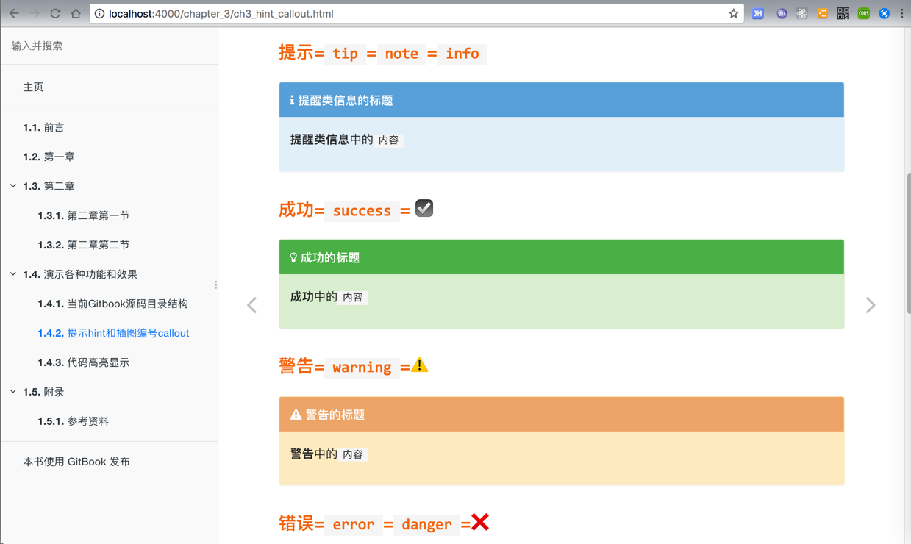
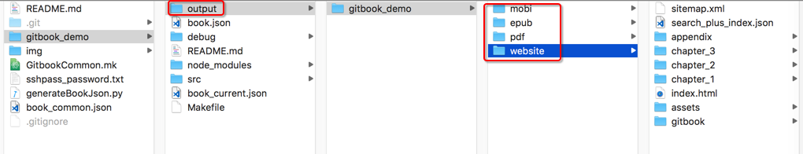

# Gitbook模板

最后更新：`20190627`

## 项目代码仓库

[https://github.com/crifan/gitbook_template](https://github.com/crifan/gitbook_template) 

## 项目作用

1. 用于演示如何使用`crifan`的**gitbook模板**
2. 别人和自己，可以基于此模板，快速方便的创建出自己的gitbook电子书

## 项目结构

此项目主要包括：

* `各种工具`：主要是自己写的`Makefile`，用于自动化`gitbook`的`初始化`、`调试`、`编译`、`提交`、`部署`等一系列过程以及相关配置或脚本工具
* `gitbook`的demo源码：写了个gitbook的demo的源码，供参考使用，用于创建一个自己的gitbook

总体目录结构和各自含义如下：

```bash
.
├── README.md
├── books
│   └── gitbook_demo            # 基于template的gitbook的demo
│       ├── Makefile            # 调用公共的Makefile
│       ├── README_current.json # 当前book的readme的部分，内部调用 common/tools/generate_readme_md.py 生成真正的 README.md
│       ├── book_current.json   # 当前book的book.json的部分，内部调用 common/tools/generate_book_json.py 生成完整的book.json
│       └── src                 # 当前gitbook的源码部分
│           ├── README.md       # 同步拷贝自 上级目录中生成的README.md
......
├── common
│   ├── config
│   │   ├── common
│   │   │   ├── common_book.json            # 所有book的共用部分，用于生成每个book的book.json
│   │   │   └── common_gitignore            # 所有book共用的gitignore，拷贝到每个book中重命名为.gitignore
│   │   ├── deploy                          # 和（编译后的pdf，html等）部署有关的内容
│   │   │   ├── deploy_ignore_book_list.txt # 如果想要部署时忽略某个book，可以把该book的名字加到这里
│   │   │   ├── deploy_server_info.mk       # 部署服务器相关信息，IP、用户、部署路径等
│   │   │   └── deploy_server_password.txt  # 部署服务器的密码，单独保存
│   │   └── template
│   │       └── template_README.md          # 所有book共用的README的模板，用于生成每个book的README.md
│   ├── gitbook_makefile.mk                 # 所有book共用的Makefile
│   └── tools
│       ├── generate_book_json.py           # 脚本，用于从book_current.json和common_book.json生成每个book的book.json
│       └── generate_readme_md.py           # 脚本，用于从README_current.json和template_README.md生成每个book的README.md
├── generated                               # 所有后续工具生成的各种文件都放到这里
│   ├── books                               # 保存每个book生成的各种文件，包括pdf，html等等
│   └── gitbook                             # 保存gitbook生成的文件，目前只有共用的node_modules
├── img                                     # 保存此README.md说明文档所用到的图片
│   ├── gitbook_debug_localhost.png
│   ├── gitbook_generated_all_files_to_ouput_folder.png
│   ├── gitbook_installed_plugin_node_modules.png
│   └── gitbook_various_hint_callout_effect.png
```

## 为何会有这个模板？

之前自己用`Gitbook`创建了很多个`book`，为了更高效和统一管理，所以把公共部分提取出来。

为了让此gitbook的框架能为别人所用，所以整理出来，做成模板和demo，供参考和使用。

此模板从无到有的过程，感兴趣的可以去看看：

* [【已解决】提取Gitbook中Makefile公共部分](http://www.crifan.com/gitbook_extract_common_part_of_makefile)
* [【已解决】gitbook中book.json中能否把公共部分提取出来](http://www.crifan.com/gitbook_extract_book_json_common_part)
* [【基本解决】Makefile中从独立文件比如json中读取配置变量](http://www.crifan.com/makefile_import_read_config_variable_from_file_like_json)
* 【规避解决】gitbook install时能否指定node_modules的安装路径
* 【已解决】优化gitbook的生成book模板提取共用的node_modules

## 使用步骤

下面详细介绍，如何使用本`Gitbook`模板，去创建一个自己的`book`

### 前提和准备

#### 已安装好gitbook

可以通过下面命令确认是否已安装好`gitbook`：

```bash
$ gitbook --version
CLI version: 2.3.2
GitBook version: 3.2.3
```

#### 手动修复bug：ENOENT no such file or directory

gitbook有个bug：

`make debug`偶尔会出现这个错误： `Error: ENOENT: no such file or directory, stat '/Users/crifan/dev/dev_root/gitbook/GitbookTemplate/gitbook_template/gitbook_demo/debug/gitbook/gitbook-plugin-copy-code-button/toggle.js'`

解决办法：

把

`/Users/换成你的用户名/.gitbook/versions/3.2.3/lib/output/website/copyPluginAssets.js`

中的`copyResources`的`confirm`从`true`改为`false`

具体步骤，详见：

* 【已解决】gitbook编译偶尔报错：Error ENOENT no such file or directory stat

### 下载模板源码

`git clone https://github.com/crifan/gitbook_template.git`

### 初始化安装`Gitbook`插件

```bash
cd gitbook_template/books/gitbook_demo/
make init
```

**作用**：内部会先`sync_content`同步和生成各种所需文件，以及再`gitbook install`去安装插件到`book`下的`node_modules`文件夹中。

插件安装后效果如图：



### 调试+编写`book`源码

```bash
make debug
```

**作用**：内部会调用`gitbook serve`去调试，把调试生成的文件都放到`generated/books/gitbook_demo/debug`文件夹中。

然后就可以去用浏览器去打开：

[http://localhost:4000/](http://localhost:4000/)

看到此`gitbook`模板demo的效果了：




然后就可以去用编辑器，比如[VSCode](https://book.crifan.com/books/best_editor_vscode/website/)，去编辑和更新自己的`markdown`=`md`源码了，然后gitbook会自动检测到文件变动，刷新页面。

### 生成静态文件：`html`,`pdf`,`epub`,`mobi`

```bash
make all
```

**作用**：内部会分别调用

* `gitbook build`：生成**静态**`html`
* `gitbook pdf`：生成`pdf`文件
* `gitbook epub`：生成`epub`文件
* `gitbook mobi`：生成`mobi`文件

生成的文件都保存到了`generated/books/gitbook_demo/release/gitbook_demo`文件夹中：



### [可选]提交`commit`+部署`deploy`

上述步骤中已经得到相关文件了，如果只是想要简单粗暴的发布到自己网站上，只需要拷贝和粘贴即可。

如果同时希望把此繁琐的人工操作自动化，则可以使用此处的工具：

```bash
make deploy
```

其中：`deploy` = `upload` + `commit`

去提交（git源码）并部署（把生成的`html`、`pdf`、`mobi`等文件上传）到自己的服务器上了

**注意**：`deploy`之前，需要修改相关信息为你自己的配置：

#### 对于`commit`

修改`common/gitbook_makefile.mk`中的`github`本地文件路径：

```make
GITHUB_IO_PATH=/Users/crifan/dev/dev_root/github/github.io/crifan.github.io
```

#### 对于`deploy`

* 修改部署服务器相关信息：
  * `common/config/deploy/deploy_server_info.mk`中的`IP`+`用户账号`+`文件上传路径`
  * `common/config/deploy/deploy_server_password.txt`中的`密码`

```make
DEPLOY_SERVER_IP=your_deploy_server_ip
DEPLOY_SERVER_USER=your_deploy_server_username
DEPLOY_SERVER_PATH=your_deploy_server_file_upload_path
```

和：
```make
your_server_password
```

比如我的是：

```make
DEPLOY_SERVER_IP=149.28.136.189
DEPLOY_SERVER_USER=root
DEPLOY_SERVER_PATH=/data/wwwroot/book.crifan.com/books
```

和

```make
xxxxxx
```

## 其他说明

### 提取共用的node_modules

如果你像我一样，不希望每个book都（通过`gitbook install`)创建自己的node_modules，以便于，用同一套gitbook的模块配置，用于多个book。

在第一次某个book的`make init`后（内部会调用`gitbook install`），会生成`node_modules`目录

则可以把`node_modules`移动到`generated/gitbook`：

`mv node_modules ../../generated/gitbook/node_modules`

然后再去当前book中加上软链接：

`ln -s ../../generated/gitbook/node_modules node_modules`

以后新增book时，只需要重新创建对应软链接即可。

### 想要部署时忽略多个book中的某个book

如果你和我一样有个（实际上很少人会有这种）特殊需求，有多个book，想要在`make deploy`时，忽略某个book，则可以去：

和`GitbookCommon.mk`同级目录中新建`deploy_ignore_book_list.txt`，然后加上要忽略部署上传的book，比如：

```bash
scientific_network_summary

```

### 此处的`book.json`和`REAMDME.md`是用脚本生成的

此处的`gitbook_demo`的：

* `gibtook`的`book.json`
* `README.md`

是用脚本生成的：

* `Makefile`中的`generate_book_json`
  * 调用`common/tools/generate_book_json.py`去从
    * 共用部分`common/config/common/common_book.json`
    * 和当前book的`book_current.json`
  * 去生成的
* `Makefile`中的`generate_readme_md`
  * 调用`common/tools/generate_readme_md.py`去从
    * 模板`README_template.md`
    * 和当前book的`README_current.json`
  * 生成的

且相关的命令：

* `make init`
* `make debug`
* `make all`

会自动（依赖）调用`generate_book_json`去生成，而无需自己手动生成。

当然，想要自己生成，则可以运行：

* `make generate_book_json`
* `make generate_readme_md`

### `make clean_all`

任何时候，都可以用`make clean_all`去清除所有生成的文件，内部包含：

* 所有的生成的文件：`clean_generated_all`
* 本地debug调试目录：`clean_debug`
* 用于发布的文件：`clean_release`
  * 具体包含：`html`、`pdf`、`epub`、`mobi`

### `make help`

对于`Makefile`如果还有其他疑问，可以通过`make help`去查看说明：

```bash
➜  gitbook_demo git:(master) ✗ make help
--------------------------------------------------------------------------------
Author  : crifan.com
Version : 20190531
Function: Auto use gitbook to generated files: website/pdf/epub/mobi; upload to remote server; commit to github io repo
                Run 'make help' to see usage
--------------------------------------------------------------------------------
CURRENT_DIR=/Users/crifan/dev/dev_root/gitbook/GitbookTemplate/gitbook_template/books/gitbook_demo
BOOK_NAME=gitbook_demo
NOT found gitbook_demo in IGNORE_FILE_CONTENT=

Usage:
  make <target>

Defaul Target: deploy

Targets:
  debug_include             Debug include file
  debug_dir                 Print current directory related info
  debug_python              Debug for makefile call python
  create_folder_debug       Create folder for gitbook local debug
  create_folder_release     Create folder for gitbook release: website+pdf+epub+mobi
  create_folder_website     Create folder for gitbook website
  create_folder_pdf         Create folder for pdf
  create_folder_epub        Create folder for epub
  create_folder_mobi        Create folder for mobi
  create_folder_all         Create folder for all: debug+release(website/pdf/epub/mobi)
  clean_generated_book_json Clean generated book.json file
  clean_generated_readme_md Clean generated README.md file
  clean_gitignore           Clean copied .gitignore
  clean_generated_all       Clean generated all files
  clean_debug               Clean gitbook debug
  clean_website             Clean generated gitbook website whole folder
  clean_pdf                 Clean generated PDF file and whole folder
  clean_epub                Clean generated ePub file and whole folder
  clean_mobi                Clean generated Mobi file and whole folder
  clean_release             Clean gitbook release
  clean_all                 Clean all generated files
  generate_readme_md        Generate README.md from ../README_template.md and README_current.json
  copy_readme               copy README.md to ./src
  copy_gitignore            copy common .gitignore
  generate_book_json        Generate book.json from ../book_common.json and book_current.json
  sync_content              sync content
  install                   gitbook install plugins
  init                      gitbook init to install plugins
  debug                     Debug gitbook
  website                   Generate gitbook website
  pdf                       Generate PDF file
  epub                      Generate ePub file
  mobi                      Generate Mobi file
  all                       Generate all files: website/pdf/epub/mobi
  upload                    Upload all genereted website/pdf/epub/mobi files to remote server using rsync. Create deploy_server_info.mk and deploy_server_password.txt which contain deploy server IP+User+Path and Password before use this
  commit                    Commit generated files to github io
  deploy                    Deploy = upload and commit for generated files
  help                      Show help
```
